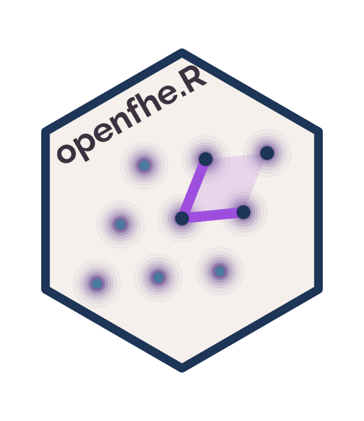

# openfhe.R 

This is an interface to the [Fully Homomorphic Encryption](https://github.com/openfheorg/openfhe-development)
library developed by [OpenFHE](https://openfhe.org).

The companion package
[homomorpheR](https://cran.r-project.org/package=homomorpheR)
(version >= 1.0, soon to be on CRAN) imports this package and includes
a number of illustrative vignettes. Specifically, the examples
demonstrate how to use existing R functions and optimizers to
implement a homomorphic-encryption protocol across multiple sites.


## Schemes

- **BFV / BGV**: exact integer arithmetic
- **CKKS**: approximate real-number arithmetic (with sin, cos, logistic, bootstrapping)
- **FHEW / TFHE (BinFHE)**: Boolean circuit evaluation

All four FHE subsystems (**BFV**, **BGV**, **CKKS**, **BinFHE**) are
exposed.  In addition, we provide facilities for serialization,
threshold FHE, CKKS bootstrapping, transcendental function evaluation,
and CKKS hoisted (fast) rotations.

## Quick Start

```r
library(openfhe.R)

# BFV: exact integer arithmetic
cc <- fhe_context("BFV", plaintext_modulus = 65537, multiplicative_depth = 2)
keys <- key_gen(cc, eval_mult = TRUE)

ct1 <- encrypt(keys@public, make_packed_plaintext(cc, 1:8), cc = cc)
ct2 <- encrypt(keys@public, make_packed_plaintext(cc, 10:17), cc = cc)

# Compute on encrypted data
result <- decrypt(ct1 + ct2, keys@secret, cc = cc)
get_packed_value(result)[1:8]
#> [1] 11 13 15 17 19 21 23 25
```

